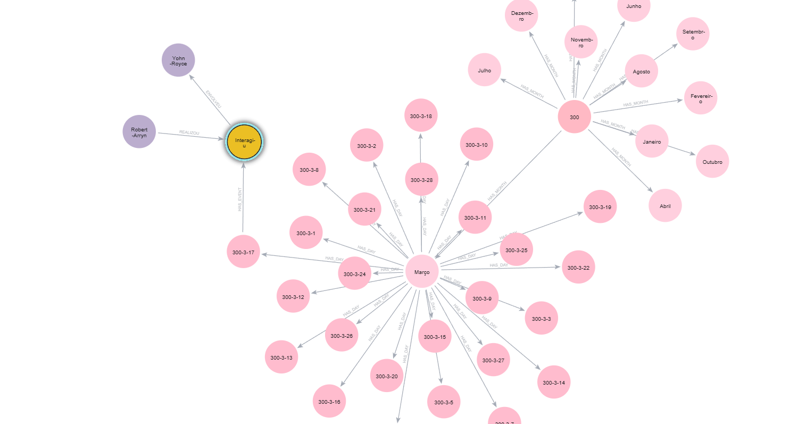
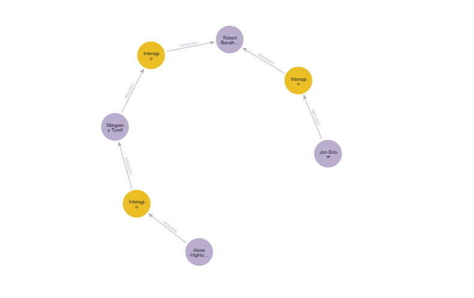
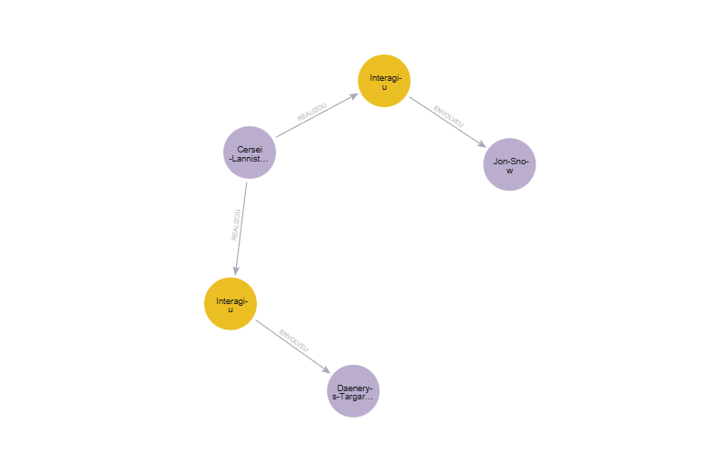

# Análise de Interações de Game of Thrones com Neo4j

Este projeto demonstra a modelagem e implementação de um sistema de análise de interações entre personagens utilizando **Neo4j**.

## 1. Modelo de Dados

O diagrama abaixo ilustra os nós (`Personagem`, `Evento`, `Ano`, `Mes`, `Dia`) e os relacionamentos (`REALIZOU`, `ENVOLVEU`, `HAS_MONTH`, `HAS_DAY`, `HAS_EVENT`) utilizados no projeto.

* **Nome da base de dados:** Game of Thrones Interactions (ASOIAF)
* **Fonte dos dados:** [MathBeveridge - ASOIAF Data](https://raw.githubusercontent.com/mathbeveridge/asoiaf/master/data/asoiaf-all-edges.csv)



## 2. Configuração e Importação de Dados

A primeira etapa consiste em preparar o banco de dados garantindo a unicidade dos identificadores e importando os dados de um arquivo CSV externo. Durante a importação, criamos uma estrutura de calendário (Ano -> Mês -> Dia) para contextualizar os eventos.

```cypher
CREATE CONSTRAINT personagem_id_unique IF NOT EXISTS FOR (p:Personagem) REQUIRE p.id IS UNIQUE;
CREATE INDEX personagem_nome_index IF NOT EXISTS FOR (p:Personagem) ON (p.nome);
CREATE CONSTRAINT ano_val IF NOT EXISTS FOR (a:Ano) REQUIRE a.valor IS UNIQUE;
CREATE CONSTRAINT mes_id IF NOT EXISTS FOR (m:Mes) REQUIRE m.id IS UNIQUE;
CREATE CONSTRAINT dia_date IF NOT EXISTS FOR (d:Dia) REQUIRE d.date IS UNIQUE;
CREATE CONSTRAINT evento_id IF NOT EXISTS FOR (e:Evento) REQUIRE e.id IS UNIQUE;

LOAD CSV WITH HEADERS FROM 'https://raw.githubusercontent.com/mathbeveridge/asoiaf/master/data/asoiaf-all-edges.csv' AS row

MERGE (source:Personagem {nome: row.Source})
MERGE (target:Personagem {nome: row.Target})

WITH source, target, row
WHERE NOT (source)-[:REALIZOU]->(:Evento)-[:ENVOLVEU]->(target)

WITH source, target, row,
     298 + toInteger(rand() * 3) AS ano_num,
     1 + toInteger(rand() * 12) AS mes_num,
     1 + toInteger(rand() * 28) AS dia_num

MERGE (y:Ano {valor: ano_num})

MERGE (m:Mes {id: toString(ano_num) + '-' + toString(mes_num)})
ON CREATE SET m.nome = CASE mes_num 
    WHEN 1 THEN 'Janeiro' WHEN 2 THEN 'Fevereiro' WHEN 3 THEN 'Março'
    WHEN 4 THEN 'Abril' WHEN 5 THEN 'Maio' WHEN 6 THEN 'Junho'
    WHEN 7 THEN 'Julho' WHEN 8 THEN 'Agosto' WHEN 9 THEN 'Setembro'
    WHEN 10 THEN 'Outubro' WHEN 11 THEN 'Novembro' WHEN 12 THEN 'Dezembro' 
END
MERGE (y)-[:HAS_MONTH]->(m)

MERGE (d:Dia {date: toString(ano_num) + '-' + toString(mes_num) + '-' + toString(dia_num)})
MERGE (m)-[:HAS_DAY]->(d)

CREATE (e:Evento {id: randomUUID()})
SET e.valor = toInteger(row.weight),
    e.tipo = "Interagiu",
    e.forma = CASE row.Type
        WHEN 'Undirected' THEN 'Indiretamente'
        WHEN 'Directed'   THEN 'Diretamente'
        ELSE 'Indefinido'
   END

MERGE (d)-[:HAS_EVENT]->(e)
MERGE (source)-[:REALIZOU]->(e)
MERGE (e)-[:ENVOLVEU]->(target);
```

> **Explicação:** O código acima inicia criando **Constraints** e **Indexes** para otimizar a busca e garantir que não duplicaremos nós (como Personagens ou Datas).
>
> Na sequência, carregamos o CSV. Como o dataset original possui apenas as interações e pesos, geramos datas aleatórias (entre os anos 298 e 300) para criar uma **Time Tree**. Isso conecta cada interação a um nó de **Evento**, que por sua vez está ligado a um **Dia**, que pertence a um **Mês** e a um **Ano**. Isso permite consultas temporais complexas posteriormente.

## 3. Análise de Caminho Mais Curto (Shortest Path)

Podemos descobrir qual a menor quantidade de conexões necessárias para ligar dois personagens distantes na trama.

```cypher
MATCH (inicio:Personagem {nome: 'Jon-Snow'})
MATCH (fim:Personagem {nome: 'Alerie-Hightower'})

MATCH path = shortestPath((inicio)-[:REALIZOU|ENVOLVEU*]-(fim))
RETURN path;
```
> **Explicação:** A função `shortestPath` ignora o peso das interações e busca apenas o menor número de saltos (hops) entre o nó de origem (`Jon-Snow`) e o nó de destino (`Alerie-Hightower`). É útil para entender graus de separação social.



## 4. Caminhos Ponderados com Dijkstra

Diferente do caminho mais curto simples, o algoritmo de Dijkstra leva em consideração o "peso" das relações (neste caso, a intensidade da interação).

```cypher
MATCH (:Personagem)-[r1:REALIZOU]->(e:Evento)
SET r1.peso = e.valor;
MATCH (e:Evento)-[r2:ENVOLVEU]->(:Personagem)
SET r2.peso = e.valor;

MATCH (inicio:Personagem {nome: 'Jon-Snow'})
MATCH (fim:Personagem {nome: 'Daenerys-Targaryen'})
CALL apoc.algo.dijkstra(
    inicio,
    fim,
    'REALIZOU|ENVOLVEU',
    'peso'
) YIELD path, weight
RETURN path, weight;
```
> **Explicação:** Primeiramente, propagamos a propriedade `valor` do nó `Evento` para as arestas `REALIZOU` e `ENVOLVEU` como uma propriedade chamada `peso`. Em seguida, utilizamos a biblioteca **APOC** para rodar o algoritmo de Dijkstra. Isso encontra um caminho entre Jon Snow e Daenerys que otimiza os pesos, revelando conexões mais "fortes" ou significativas, não apenas as mais curtas.



## 5. Timeline Narrativa (Storytelling)

Graças à Time Tree criada na importação, podemos reconstruir a história linear entre dois personagens.

```cypher
MATCH (p1:Personagem {nome: 'Jon-Snow'})
MATCH (p2:Personagem {nome: 'Samwell-Tarly'})

MATCH (p1)-[:REALIZOU|ENVOLVEU]-(e:Evento)-[:REALIZOU|ENVOLVEU]-(p2)

MATCH (y:Ano)-[:HAS_MONTH]->(m:Mes)-[:HAS_DAY]->(d:Dia)-[:HAS_EVENT]->(e)

RETURN 
    y.valor AS Ano, 
    m.nome AS Mes, 
    d.date AS Data_Completa, 
    e.forma AS Tipo, 
    e.valor AS Intensidade
ORDER BY y.valor, m.id, d.date;
```
> **Explicação:** Esta query localiza todos os eventos em que ambos os personagens participaram e navega "para trás" na árvore de tempo (do **Evento** para o **Dia**, **Mês** e **Ano**). O resultado é uma lista cronológica das interações, permitindo contar uma história.

## 6. Análise de Sazonalidade ("Mês Sangrento")

Quais meses concentraram a maior quantidade de conflitos ou interações intensas?

```cypher
MATCH (m:Mes)-[:HAS_DAY]->(:Dia)-[:HAS_EVENT]->(e:Evento)
RETURN 
    m.nome AS Mes, 
    count(e) AS Total_Eventos, 
    sum(e.valor) AS Intensidade_Total
ORDER BY Total_Eventos DESC;
```
> **Explicação:** Agregamos todos os eventos pelo nó **Mes**. Contamos quantos eventos ocorreram (`count`) e somamos seus pesos (`sum`) para medir a intensidade total.

```text
╒═══════════╤═════════════╤═════════════════╕
│Mes        │Total_Eventos│Intensidade_Total│
╞═══════════╪═════════════╪═════════════════╡
│"Dezembro" │257          │2636             │
├───────────┼─────────────┼─────────────────┤
│"Agosto"   │257          │3122             │
├───────────┼─────────────┼─────────────────┤
│"Setembro" │248          │2513             │
├───────────┼─────────────┼─────────────────┤
│"Janeiro"  │241          │2965             │
├───────────┼─────────────┼─────────────────┤
│"Junho"    │239          │2758             │
├───────────┼─────────────┼─────────────────┤
│"Outubro"  │235          │2967             │
├───────────┼─────────────┼─────────────────┤
│"Fevereiro"│234          │3021             │
├───────────┼─────────────┼─────────────────┤
│"Novembro" │228          │2475             │
├───────────┼─────────────┼─────────────────┤
│"Maio"     │223          │2579             │
├───────────┼─────────────┼─────────────────┤
│"Julho"    │221          │2678             │
├───────────┼─────────────┼─────────────────┤
│"Abril"    │221          │2193             │
├───────────┼─────────────┼─────────────────┤
│"Março"    │219          │2722             │
└───────────┴─────────────┴─────────────────┘
```

## 7. Análise de Contexto (Quem estava lá?)

Identificando os momentos de maior tensão (batalhas ou grandes tramas) e listando os envolvidos.

```cypher
MATCH (d:Dia)-[:HAS_EVENT]->(e:Evento)
WHERE e.valor > 20
MATCH (p:Personagem)-[:REALIZOU|ENVOLVEU]-(e)

RETURN 
    d.date AS Data, 
    e.valor AS Peso_Evento, 
    collect(p.nome) AS Participantes
ORDER BY e.valor DESC
LIMIT 5;
```
> **Explicação:** Filtramos eventos com peso superior a 20 (indicativo de alta relevância). Usamos `collect(p.nome)` para agrupar todos os personagens conectados àquele evento específico em uma lista.

```text
╒═══════════╤═══════════╤═════════════════════════════════════════╕
│Data       │Peso_Evento│Participantes                            │
╞═══════════╪═══════════╪═════════════════════════════════════════╡
│"299-7-1"  │334        │["Eddard-Stark", "Robert-Baratheon"]     │
├───────────┼───────────┼─────────────────────────────────────────┤
│"300-1-21" │228        │["Jon-Snow", "Samwell-Tarly"]            │
├───────────┼───────────┼─────────────────────────────────────────┤
│"298-2-23" │222        │["Joffrey-Baratheon", "Sansa-Stark"]     │
├───────────┼───────────┼─────────────────────────────────────────┤
│"299-10-15"│219        │["Joffrey-Baratheon", "Tyrion-Lannister"]│
├───────────┼───────────┼─────────────────────────────────────────┤
│"298-1-7"  │209        │["Bran-Stark", "Hodor"]                  │
└───────────┴───────────┴─────────────────────────────────────────┘
```

## 8. Triângulos Temporais ("A Fofoca")

Análise de propagação de informação ou interação indireta que ocorre dentro do mesmo contexto temporal (ano).

```cypher
MATCH (p1:Personagem {nome: 'Tyrion-Lannister'})-[:REALIZOU]->(e1:Evento)-[:ENVOLVEU]->(p2:Personagem)
MATCH (p2)-[:REALIZOU]->(e2:Evento)-[:ENVOLVEU]->(p3:Personagem)

WHERE p1 <> p3 

MATCH (y:Ano)-[:HAS_MONTH]->()-[:HAS_DAY]->()-[:HAS_EVENT]->(e1)
MATCH (y)-[:HAS_MONTH]->()-[:HAS_DAY]->()-[:HAS_EVENT]->(e2)

RETURN 
    p1.nome + " falou com " + p2.nome AS Passo_1,
    p2.nome + " falou com " + p3.nome AS Passo_2,
    y.valor AS Durante_o_Ano
LIMIT 10;
```
> **Explicação:** Esta query busca um padrão de tríade: A interage com B, e B interage com C. A cláusula `WHERE` garante que A e C são pessoas diferentes. As cláusulas `MATCH (y:Ano)` adicionais forçam que ambos os eventos tenham ocorrido sob o mesmo nó de **Ano**, validando o contexto temporal.

```text
╒════════════════════════════════════════════╤═══════════════════════════════════════╤═════════════╕
│Passo_1                                     │Passo_2                                │Durante_o_Ano│
╞════════════════════════════════════════════╪═══════════════════════════════════════╪═════════════╡
│"Tyrion-Lannister falou com Tywin-Lannister"│"Tywin-Lannister falou com Walder-Frey"│299          │
└────────────────────────────────────────────┴───────────────────────────────────────┴─────────────┘
```